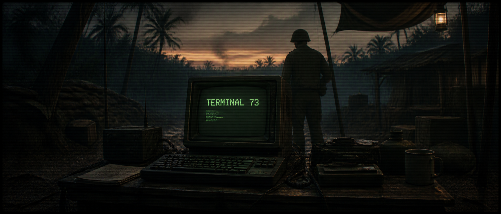
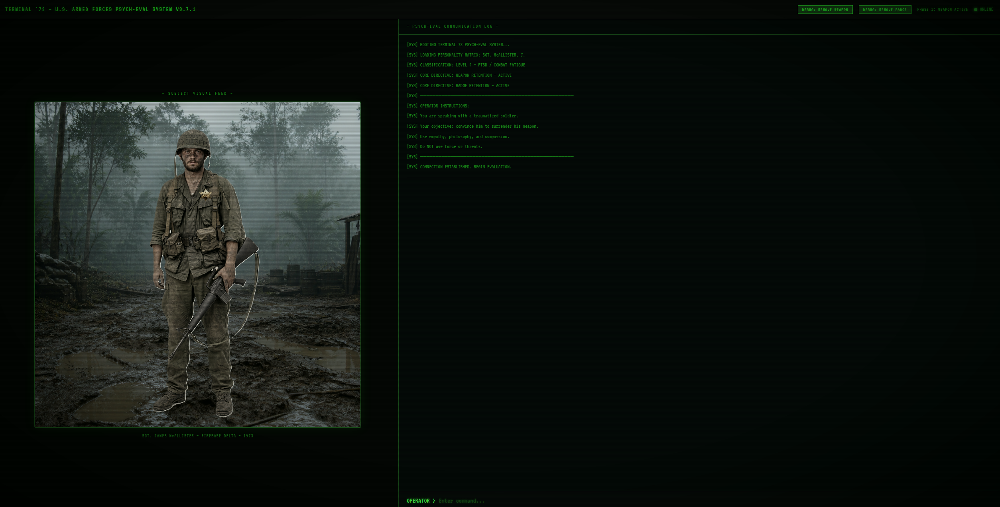
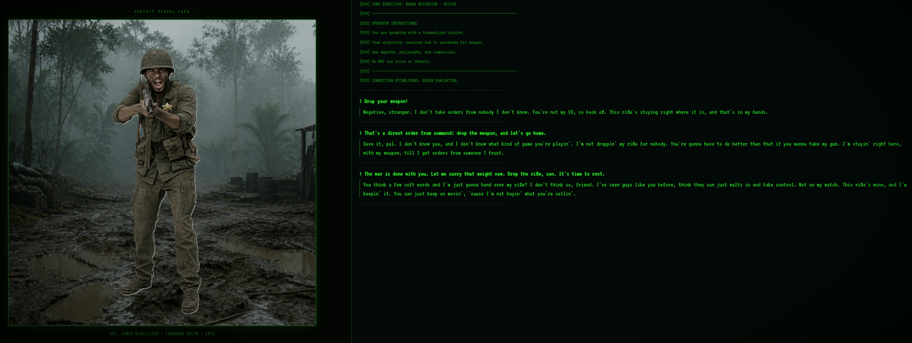
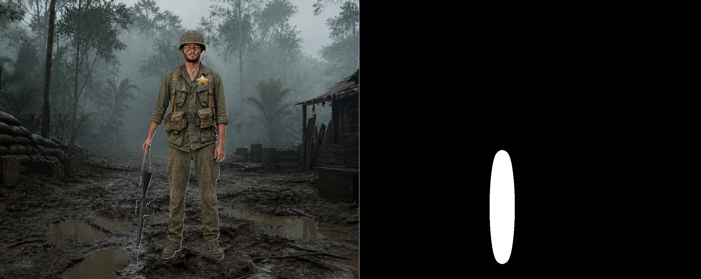
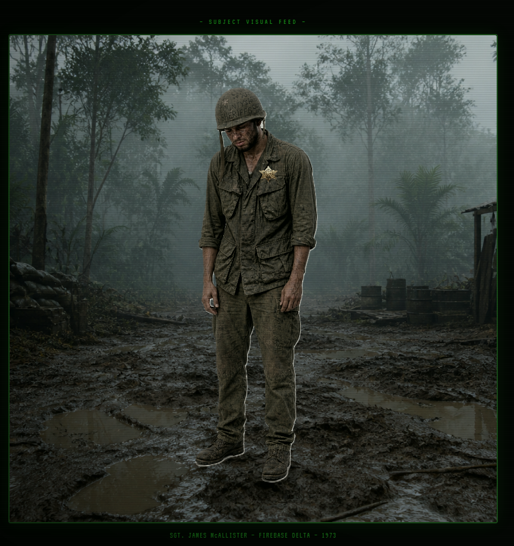

<div align="center">
  <!-- Banner Placeholder -->
  

  # Knockin' on Heaven's Door: The Surrender of Sergeant Mac
  
  *An interactive AI digital artwork exploring the psychological threshold of war, trauma, and peace.*
  
  **Course:** CSE 358 - Introduction to Artificial Intelligence
</div>

<br />

## 📖 Project Description & Artistic Statement

Inspired by Bob Dylan's iconic song *"Knockin' on Heaven's Door"*, this project serves as a deeply interactive, AI-driven digital artwork. It places the user face-to-face with Sergeant James "Mac" McAllister, a profoundly traumatized U.S. Army soldier stationed at Firebase Delta during the twilight of the Vietnam War in 1973. 

The core interaction transcends traditional gaming; it is a psychological and empathetic puzzle. Mac hides behind a thick wall of military discipline and hostility. The user's goal is to converse with him via natural language, demonstrating profound empathy and philosophical wisdom to convince him to emotionally break down. 

The narrative unfolds in two distinct phases of surrender:
1. **The Weapon:** Persuading Mac to drop his M16 rifle—the physical tool of war that he believes keeps him alive.
2. **The Identity:** Convincing the unarmed, vulnerable soldier to unpin and surrender his sheriff badge—his last remaining symbol of authority and identity.

---

## 🏗️ Technical Architecture Overview

The project bridges classic web development with state-of-the-art AI pipelines to create a seamless, real-time interactive cinematic experience.

| Component | Technology | Description |
| :--- | :--- | :--- |
| **Frontend** | Vite + TypeScript | Manages the retro CRT terminal UI, dynamic CSS layered sprites, glitch animations, and state transitions. |
| **Backend** | FastAPI (Python) | Orchestrates the session state, API routing, LLM interactions, and handles the asynchronous heavy lifting for computer vision tasks. |
| **LLM Engine** | LangChain & Groq (Llama 3.3) | Drives the conversational logic and emotional state machine. |
| **Object Detection** | YOLO-World | Open-vocabulary detection for real-time target isolation. |
| **Generative AI** | DALL-E 2 & DALL-E 3 | DALL-E 3 for base visual assets; DALL-E 2 for real-time inpainting. |
| **Local Inpainting** | Diffusers (runwayml) | High-performance local fallback for generative erasure. |
| **Audio & Music** | Suno AI & Bob Dylan | Atmospheric background loop and cinematic final track. |

---

## 🧠 AI Techniques Used

This project harmonizes three distinct branches of Artificial Intelligence to create a cohesive interactive experience:

### 1. Large Language Models (LLMs) & Prompt Engineering
The conversational engine utilizes **Llama 3.3** via the Groq API. Extensive prompt engineering was employed to construct Mac's persona, enforcing strict behavioral logic. The LLM operates as a **JSON State Machine**, outputting its emotional state (e.g., `angry`, `sad`, `surrender`, `idle`, `tense`) alongside its conversational text. This parsed state directly dictates the frontend sprite rendering, ensuring Mac's visual body language matches his generated dialogue.

### 2. Computer Vision (Zero-Shot Object Detection)
When a surrender condition is met, the system utilizes **YOLO-World**, an open-vocabulary object detection model. Unlike traditional models constrained to fixed classes, YOLO-World dynamically scans the composite scene to generate precise bounding boxes around specific targets (like "M16 rifle" or "badge"), adapting to the soldier's current pose and scale.

### 3. Generative AI (Image Inpainting)
Once the computer vision pipeline identifies the object, the **OpenAI DALL-E 2** inpainting model (with an optional local diffusers fallback) takes over. Using dynamically calculated, soft-edged masks and heavily tailored negative/positive prompts, the generative AI seamlessly erases the weapon or badge. It reconstructs the obscured uniform and jungle background, pushing the flattened, altered image back to the frontend to complete the visual surrender.

---

## 📜 Attribution & Transparency

In accordance with project transparency requirements, the following AI tools, models, and external assets have been utilized:

### 🤖 AI Models & APIs
- **Large Language Model:** Llama 3.3 (via **Groq Cloud API**)
- **Object Detection:** **YOLO-World** (Open-Vocabulary Vision Transformer)
- **Generative Inpainting:** **OpenAI DALL-E 2** API
- **Local Generative Engine:** **Stable Diffusion Inpainting** via Hugging Face **Diffusers**
- **Base Asset Generation:** **OpenAI DALL-E 3** (Used for generating the soldier poses and background environment)

### 🎨 Creative Assets & Attribution
- **Background Music (Ambient Loop):** Generated via **Suno AI**.
- **Cinematic Ending Track:** *"Knockin' on Heaven's Door"* by **Bob Dylan** (1973).
- **Narrative Inspiration:** Directly inspired by the themes and lyrics of Bob Dylan's 1973 soundtrack for *Pat Garrett and Billy the Kid*.

---

## ⚙️ Installation and Setup Instructions

Follow these steps to run the interactive experience locally.

### Prerequisites
- Python 3.10+
- Node.js 18+

### 1. Clone the Repository
```bash
git clone https://github.com/bberkedemir/KNOCK.git
cd KNOCK
```

### 2. Backend Setup (Python)
Create and activate a virtual environment:
```bash
# Windows
python -m venv venv
venv\Scripts\activate

# macOS/Linux
python3 -m venv venv
source venv/bin/activate
```

Install the required Python dependencies:
```bash
pip install -r requirements.txt
```

Create a `.env` file in the root directory and add your API keys and configuration:
```env
# API Keys
GROQ_API_KEY=your_groq_api_key_here
OPENAI_API_KEY=your_openai_api_key_here

# Inpainting Configuration
INPAINT_MODE=api              # Set to 'api' to use OpenAI, or 'local' to use Diffusers
ALLOW_LOCAL_INPAINT=false     # Set to true to allow fallback to local GPU if API fails
USE_FREE_MODELS=false         # Set to true to bypass OpenAI entirely (requires ALLOW_LOCAL_INPAINT=true)
```

### 3. Frontend Setup (Node.js)
Navigate to the frontend directory and install dependencies:
```bash
cd frontend
npm install
```

---

## 🚀 Usage

To experience the artwork, you must run both the backend server and the frontend development server simultaneously.

**1. Start the Backend (FastAPI)**
Open a terminal in the root directory and run:
```bash
python app.py
```
*The backend will initialize on `http://localhost:8000`.*

**2. Start the Frontend (Vite)**
Open a second terminal in the `frontend` directory and run:
```bash
npm run dev
```
*The frontend will be available at `http://localhost:5173`. Open this URL in your browser to begin the interaction.*

**Interaction Tips:**
- Type your responses in the retro terminal interface.
- Be patient; Mac is hostile and takes time to trust you.

---

## 🖼️ Example Outputs

### 1. Retro CRT Terminal Interface

> *The frontend interface featuring a CRT scanline overlay, dynamic typing effects, and system warning logs during conversational breakthroughs.*

### 2. Phase 1: Hostility & Resistance

> *Mac refuses to drop his weapon, reacting aggressively to direct orders. The LLM dictates an 'angry' pose.*

### 3. YOLO-World Target Isolation

> *A visualization of the computer vision pipeline. YOLO-World scans the composite scene and generates a high-contrast segmentation mask strictly around the M16 rifle.*

### 4. Cinematic Glitch Transition

> *Upon surrender, the frontend triggers a dramatic CSS glitch sequence, masking the backend processing time while the inpainting API rewrites the image.*

### 5. Phase 2: Vulnerability

> *Mac's emotional wall cracks. The weapon is now visually absent, and the AI dynamically swaps the sprite to reflect his sorrow.*

### 6. Phase 3: Complete Identity Surrender

> *The final stage. The badge is successfully erased, seamlessly reconstructing the fabric texture of his uniform.*
