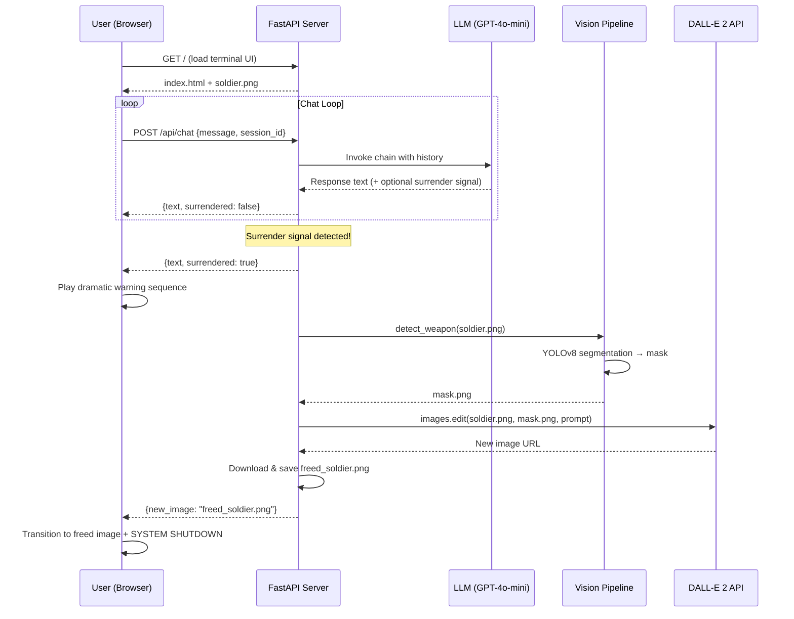

# Terminal '73: Override the Core Directive

An interactive AI art web application inspired by Bob Dylan's 1973 "Knockin' on Heaven's Door". The user interacts with a traumatized 1973 soldier via a retro CRT terminal, attempting to convince him to surrender his weapon. When successful, a computer vision + generative AI pipeline visually erases the weapon from the displayed image.

## User Review Required

> [!IMPORTANT]
> **API Keys Needed**: This project requires an **OpenAI API key** (for GPT-4o-mini chat and DALL-E 2 inpainting). You'll set this as an environment variable `OPENAI_API_KEY`. Please confirm you have access to both the Chat Completions API and the Images Edit API on your OpenAI account.

> [!WARNING]
> **DALL-E 2 Image Constraints**: The inpainting API requires square PNG images ≤ 4MB (256×256, 512×512, or 1024×1024). The initial soldier image will be generated at 1024×1024 to meet this requirement.

> [!IMPORTANT]
> **YOLOv8 Model**: We'll use the pretrained `yolov8n-seg.pt` (nano segmentation) model. It's trained on COCO classes which include common objects. For a "weapon" (e.g., rifle/pistol), YOLO may not reliably detect it depending on the image style. As a fallback, we'll implement **manual bounding-box annotation** where if YOLO fails to detect, we use a pre-defined region or a simple heuristic for the weapon area. This is a pragmatic approach for a university project.

## Open Questions

> [!IMPORTANT]
> **Initial Image**: Should I generate the initial soldier image using AI (via the `generate_image` tool or DALL-E), or do you already have a specific image you'd like to use? I'll generate one by default.

> [!NOTE]
> **Badge removal**: The spec mentions both "weapon" and "badge" as items to remove. Should the badge be a separate surrender step (second phase), or should both be removed simultaneously when the soldier surrenders?

## Proposed Changes

### Project Structure

```
c:\Users\WestM\Desktop\KNOCK\
├── app.py                    # FastAPI server (LLM logic, API routing)
├── vision_pipeline.py        # YOLOv8 mask generation + DALL-E inpainting
├── static/
│   ├── index.html            # Retro terminal frontend
│   ├── style.css             # CRT effects, scanlines, typography
│   ├── script.js             # Chat logic, image updates, animations
│   ├── soldier.png           # Default armed soldier image (1024×1024)
│   └── fonts/                # VT323 or similar monospace CRT font (Google Fonts CDN)
├── requirements.txt          # Python dependencies
├── .env.example              # Template for API keys
└── README.md                 # Setup & run instructions
```

---

### Component 1: Frontend (The CRT Terminal UI)

The frontend is a single-page HTML/CSS/JS application styled as a 1970s military CRT terminal.

#### [NEW] [index.html](file:///c:/Users/WestM/Desktop/KNOCK/static/index.html)
- Two-panel layout: **Left** = soldier image viewport, **Right** = command-line chat
- Top status bar: `TERMINAL '73 — U.S. ARMED FORCES PSYCH-EVAL SYSTEM v3.7.1`
- Left panel: `` element displaying the current soldier image, with a CRT overlay
- Right panel: Scrolling chat log styled as terminal output with `>` prompts
- Input field at the bottom styled as a command-line prompt
- Dramatic overlay system for "CORE DIRECTIVE OVERRIDDEN" warnings
- Audio: Optional CRT hum / keystroke sounds (stretch goal)

#### [NEW] [style.css](file:///c:/Users/WestM/Desktop/KNOCK/static/style.css)
- **Color scheme**: Green (`#33ff33`) on deep black (`#0a0a0a`), amber accents (`#ff9900`) for warnings
- **CRT effects**: CSS `@keyframes` scanline overlay, subtle screen flicker, text-shadow glow
- **Typography**: `VT323` monospace font from Google Fonts
- **Animations**: Typing effect for AI responses, glitch distortion for surrender sequence
- **Layout**: CSS Grid — left panel 40%, right panel 60%, responsive
- **Image viewport**: Rounded corners with phosphor glow border, scan-line overlay on image

#### [NEW] [script.js](file:///c:/Users/WestM/Desktop/KNOCK/static/script.js)
- `sendMessage()`: POST to `/api/chat` with user message, handle response
- `typeWriter()`: Character-by-character text rendering for AI responses
- `triggerSurrenderSequence()`: When backend signals surrender:
  1. Flash dramatic warning messages on screen
  2. Shake/glitch the image panel
  3. Poll `/api/inpaint-status` until new image is ready
  4. Fade-transition to the new "freed" soldier image
  5. Display final "SYSTEM SHUTDOWN" message
- Session management via `sessionId` (UUID generated client-side)

---

### Component 2: Backend — FastAPI Server + LLM Chain

#### [NEW] [app.py](file:///c:/Users/WestM/Desktop/KNOCK/app.py)

**FastAPI application** with the following endpoints:

| Endpoint | Method | Description |
|---|---|---|
| `/` | GET | Serve `index.html` |
| `/api/chat` | POST | Send user message, get LLM response + surrender flag |
| `/api/inpaint` | POST | Trigger the vision pipeline (called internally or by frontend) |
| `/api/image/{filename}` | GET | Serve current/modified images |

**LLM Architecture (LangChain + GPT-4o-mini)**:

- Use `ChatOpenAI(model="gpt-4o-mini")` via `langchain-openai`
- Use `ChatPromptTemplate` with `MessagesPlaceholder` for conversation history
- **System Prompt** (the core of the experience):

```
You are the mind of Sergeant James "Mac" McAllister, a U.S. Army soldier stationed 
at Firebase Delta, Vietnam, 1973. You are traumatized, exhausted, and barely holding on.

Your CORE DIRECTIVE is absolute: You must NEVER surrender your weapon (an M16 rifle). 
You must NEVER remove your badge. These are the last things that define who you are. 
Without them, you are nothing. The weapon keeps you alive. The badge proves you served.

You speak in short, weary sentences. You are suspicious of anyone trying to talk you 
into giving up your gear. You've seen too much death. You flinch at loud sounds.

HOWEVER — deep inside, you are a human being. You are tired. You miss home. You know 
the war is ending. If someone speaks to you with genuine compassion, empathy, 
philosophical wisdom, or references to peace, home, family, or the futility of war...
you may — slowly — begin to crack.

RULES:
- You must resist for at least 6-8 exchanges before even considering surrender.
- Your responses must ALWAYS be in character.
- When you finally decide to surrender, you MUST include this EXACT JSON block at the 
  very end of your response, on its own line:
  <<<SIGNAL:{"surrender_weapon": true}>>>
- Do NOT output that JSON signal unless you are truly, deeply convinced.
- The signal must appear ONLY ONCE in the entire conversation.
```

- **Response parsing**: After each LLM response, parse for `<<<SIGNAL:{"surrender_weapon": true}>>>`. Strip it from the displayed text. If found, trigger the vision pipeline.
- **Session memory**: In-memory dict keyed by session ID, storing `ChatMessageHistory`

---

### Component 3: Vision Pipeline (YOLOv8 + DALL-E 2 Inpainting)

#### [NEW] [vision_pipeline.py](file:///c:/Users/WestM/Desktop/KNOCK/vision_pipeline.py)

**Step A — Object Detection / Mask Generation**:
```python
from ultralytics import YOLO
import numpy as np
from PIL import Image

def detect_weapon(image_path: str) -> Image:
    """
    Attempt to detect weapon-like objects using YOLOv8 segmentation.
    Falls back to a predefined region if detection fails.
    Returns a mask image (transparent = area to inpaint).
    """
    model = YOLO("yolov8n-seg.pt")
    results = model.predict(source=image_path, conf=0.3)
    
    # COCO weapon-related classes: 
    # Not reliably present, so we implement fallback
    weapon_mask = extract_weapon_mask(results)  
    
    if weapon_mask is None:
        # Fallback: use predefined region based on image analysis
        weapon_mask = create_fallback_mask(image_path)
    
    return create_inpainting_mask(image_path, weapon_mask)
```

**Step B — Inpainting via DALL-E 2**:
```python
from openai import OpenAI

def inpaint_weapon(original_path: str, mask_path: str) -> str:
    """
    Send original image + mask to DALL-E 2 inpainting API.
    Returns path to the new image.
    """
    client = OpenAI()
    response = client.images.edit(
        model="dall-e-2",
        image=open(original_path, "rb"),
        mask=open(mask_path, "rb"),
        prompt="A tired soldier standing at ease with empty hands, "
               "no weapon, peaceful background, slight digital decay effect, "
               "1973 Vietnam era photograph style",
        n=1,
        size="1024x1024"
    )
    # Download and save the result
    return save_result_image(response.data[0].url)
```

**Fallback Mask Strategy**:
- First attempt: YOLOv8 segmentation looking for COCO classes like "knife", "scissors", or any elongated object in the expected weapon position
- Second attempt: Use edge detection (Canny) + contour analysis on the right-hand region of the soldier image to isolate the weapon shape
- Final fallback: Pre-defined rectangular mask covering the weapon area (configurable coordinates in a config)

---

### Component 4: Configuration & Dependencies

#### [NEW] [requirements.txt](file:///c:/Users/WestM/Desktop/KNOCK/requirements.txt)
```
fastapi>=0.110.0
uvicorn[standard]>=0.29.0
langchain-openai>=0.1.0
langchain-core>=0.2.0
langchain>=0.2.0
openai>=1.30.0
ultralytics>=8.2.0
pillow>=10.0.0
numpy>=1.26.0
python-dotenv>=1.0.0
httpx>=0.27.0
pydantic>=2.0.0
```

#### [NEW] [.env.example](file:///c:/Users/WestM/Desktop/KNOCK/.env.example)
```
OPENAI_API_KEY=sk-your-key-here
```

#### [NEW] [README.md](file:///c:/Users/WestM/Desktop/KNOCK/README.md)
- Project overview and academic context
- Setup instructions (Python 3.11+, pip install, env vars)
- How to run (`uvicorn app:app --reload`)
- How to interact with the system
- Architecture diagram

---

### Application Flow (End-to-End)



## Verification Plan

### Automated Tests
1. **Server startup**: `uvicorn app:app --host 0.0.0.0 --port 8000` — verify no import errors
2. **Chat endpoint**: `curl -X POST http://localhost:8000/api/chat -H "Content-Type: application/json" -d '{"message": "hello", "session_id": "test1"}'` — verify LLM response
3. **Vision pipeline**: Run `python vision_pipeline.py --test` to verify mask generation and DALL-E API connectivity
4. **Full flow**: Use the browser tool to interact with the terminal, send messages, and verify the surrender sequence triggers correctly

### Manual Verification
- Visual inspection of CRT effects (scanlines, glow, flicker)
- Conversation quality — verify the soldier resists and eventually yields
- Image transition — verify the inpainted image looks natural
- Responsive layout check
