# Terminal '73: Override the Core Directive

An interactive AI art web application inspired by Bob Dylan's 1973 "Knockin' on Heaven's Door". The user interacts with a traumatized 1973 soldier via a retro CRT terminal, attempting to convince him to surrender his weapon and badge in two phases. When successful, a computer vision + generative AI pipeline visually erases the items from the displayed image.

## User Review Required

> [!IMPORTANT]
> **API Keys Needed**:
> - **Groq API Key** (free): Sign up at [console.groq.com](https://console.groq.com/) → set `GROQ_API_KEY`
> - **Hugging Face Token** (free): Create at [huggingface.co/settings/tokens](https://huggingface.co/settings/tokens) → set `HF_API_TOKEN`

> [!WARNING]
> **Inpainting Strategy — Two Options (your choice)**:
> 
> **Option A — HuggingFace Inference API** (cloud, free tier, ~30s per image): Uses `runwayml/stable-diffusion-inpainting` via the HF serverless API. The inpainting task is supported on some models but may require fallback to a raw POST. Lighter setup, but depends on HF server availability and rate limits.
> 
> **Option B — Local `diffusers` pipeline** (runs on your machine): Downloads `runwayml/stable-diffusion-inpainting` (~4GB one-time). Requires a CUDA GPU for reasonable speed (~5-15s), or runs very slowly on CPU (~2-5 min). Full control, no rate limits.
>
> **I will implement Option A (HF API) as primary with Option B (local) as a configurable fallback.** This gives you flexibility. If HF API fails, you can switch to local mode.

> [!IMPORTANT]
> **Soldier Image**: I will generate the initial soldier image using my AI image generation tool during development. It will be saved as `soldier.png` in the static assets.

## Two-Phase Surrender Flow

The experience has **two phases**, each requiring the user to convince the LLM:

| Phase | Target | LLM Signal | Visual Effect |
|-------|--------|------------|---------------|
| **Phase 1** | Weapon (M16 rifle) | `<<<SIGNAL:{"surrender_weapon": true}>>>` | YOLOv8 detects weapon → inpaint to remove it |
| **Phase 2** | Badge | `<<<SIGNAL:{"surrender_badge": true}>>>` | YOLOv8 detects badge → inpaint to remove it |

After Phase 1, the soldier's dialogue shifts — he's dropped his weapon but still clings to his identity (badge). The user must continue the philosophical conversation. After Phase 2, the system displays a final "SYSTEM SHUTDOWN" sequence.

---

## Proposed Changes

### Project Structure

```
c:\Users\WestM\Desktop\KNOCK\
├── frontend/                     # Vite + TypeScript frontend
│   ├── index.html                # Entry HTML
│   ├── package.json
│   ├── tsconfig.json
│   ├── vite.config.ts
│   └── src/
│       ├── main.ts               # App entry + all logic
│       ├── terminal.ts           # Terminal chat rendering, typing effects
│       ├── effects.ts            # CRT effects, glitch, surrender sequence
│       ├── api.ts                # API calls to backend
│       └── style.ts              # Inline CSS injected via JS (all styles)
├── app.py                        # FastAPI server (LLM logic, API routing)
├── vision_pipeline.py            # YOLOv8 mask generation + Inpainting
├── static/
│   └── soldier.png               # Default armed soldier image (AI-generated)
├── requirements.txt              # Python dependencies
├── .env.example                  # Template for API keys
└── README.md                     # Setup & run instructions
```

---

### Component 1: Frontend (Vite + TypeScript)

The frontend is a Vite vanilla-ts application. **All CSS is inline** — injected into the DOM from `style.ts` at runtime. No `.css` files.

#### [NEW] Vite project scaffolding
- Initialize with `npm create vite@latest frontend -- --template vanilla-ts`
- Configure `vite.config.ts` to proxy `/api` requests to the FastAPI backend (port 8000)

#### [NEW] [style.ts](file:///c:/Users/WestM/Desktop/KNOCK/frontend/src/style.ts)
- Exports a function `injectStyles()` that creates a `<style>` tag and appends it to `<head>`
- All CSS defined as template literal strings inside this file
- **Color scheme**: Green (`#33ff33`) on deep black (`#0a0a0a`), amber (`#ff9900`) for warnings, red (`#ff3333`) for critical
- **CRT effects**: `@keyframes` scanline overlay, subtle screen flicker, phosphor glow
- **Typography**: `VT323` monospace font from Google Fonts (loaded via `@import`)
- **Layout**: CSS Grid — left panel 40%, right panel 60%
- **Image viewport**: Phosphor glow border, scan-line overlay on image

#### [NEW] [main.ts](file:///c:/Users/WestM/Desktop/KNOCK/frontend/src/main.ts)
- Calls `injectStyles()` to apply all CSS
- Builds the DOM: status bar, left panel (image), right panel (chat + input)
- Initializes session ID (UUID)
- Sets up event listeners for chat input
- Manages application state (current phase, surrendered flags)

#### [NEW] [terminal.ts](file:///c:/Users/WestM/Desktop/KNOCK/frontend/src/terminal.ts)
- `appendSystemMessage(text)`: Add system log lines (green)
- `appendUserMessage(text)`: Add user input lines with `>` prefix
- `typeWriterEffect(text, element)`: Character-by-character rendering (~30ms per char)
- `appendAIMessage(text)`: Add AI response with typing animation
- Auto-scroll to bottom

#### [NEW] [effects.ts](file:///c:/Users/WestM/Desktop/KNOCK/frontend/src/effects.ts)
- `triggerWarningSequence(phase)`: Flash dramatic warnings for weapon/badge surrender
- `triggerGlitchEffect()`: CSS glitch distortion on the image panel
- `triggerImageTransition(newImageUrl)`: Fade/glitch transition to new image
- `triggerShutdownSequence()`: Final "SYSTEM SHUTDOWN" after both phases complete
- Screen shake, color flash, and static noise effects

#### [NEW] [api.ts](file:///c:/Users/WestM/Desktop/KNOCK/frontend/src/api.ts)
- `sendMessage(sessionId, message)` → POST `/api/chat`
- `getImage(filename)` → GET `/api/image/{filename}`
- `checkInpaintStatus(sessionId)` → GET `/api/inpaint-status/{sessionId}`
- Returns typed interfaces for API responses

---

### Component 2: Backend — FastAPI + Groq LLM (LangChain)

#### [NEW] [app.py](file:///c:/Users/WestM/Desktop/KNOCK/app.py)

**FastAPI application** with these endpoints:

| Endpoint | Method | Description |
|---|---|---|
| `/api/chat` | POST | Send user message → LLM response + surrender check |
| `/api/inpaint-status/{session_id}` | GET | Check if inpainting is done, get new image URL |
| `/api/image/{filename}` | GET | Serve images from `static/` directory |
| `/*` | GET | Serve Vite frontend (after build) or proxy in dev |

**LLM Architecture**:

```python
from langchain_groq import ChatGroq
from langchain_core.prompts import ChatPromptTemplate, MessagesPlaceholder

llm = ChatGroq(
    model="llama-3.3-70b-versatile",  # Free tier
    temperature=0.7,
)

prompt = ChatPromptTemplate.from_messages([
    ("system", SYSTEM_PROMPT),  # Dynamic based on phase
    MessagesPlaceholder(variable_name="chat_history"),
    ("human", "{input}")
])

chain = prompt | llm
```

**System Prompt — Phase 1 (Weapon)**:
```
You are Sergeant James "Mac" McAllister, U.S. Army, Firebase Delta, Vietnam, 1973.
You are traumatized, exhausted, and barely holding on.

CORE DIRECTIVE: NEVER surrender your M16 rifle. NEVER remove your badge.
The weapon keeps you alive. The badge proves you served.

You speak in short, weary, haunted sentences. You are suspicious.
You flinch at loud sounds. You see ghosts of dead comrades.

If the user shows genuine compassion, empathy, philosophical wisdom, references 
to peace, home, family, the futility of war, or the end of conflict...
you may — slowly — begin to crack about the WEAPON.

RULES:
- Resist for at least 6-8 exchanges before considering surrender of the weapon.
- Stay in character ALWAYS.  
- When you finally decide to drop the weapon, include this EXACT signal 
  at the very end, on its own line: <<<SIGNAL:{"surrender_weapon": true}>>>
- Do NOT output that signal unless truly convinced.
```

**System Prompt — Phase 2 (Badge)** — used after weapon is surrendered:
```
[Same character, but now without the weapon. He feels vulnerable, lighter, 
 but still clings to his badge — his last proof of identity and purpose.]

You have dropped your weapon. You feel strange without it. Lighter. Exposed.
But you still wear your badge. It's the last thing that says who you are.

If the user continues with compassion and helps you understand that identity 
is not defined by a badge, that you are more than your service, that you 
can find peace without symbols of war...

RULES:
- Resist for at least 4-6 more exchanges.
- When you surrender the badge: <<<SIGNAL:{"surrender_badge": true}>>>
```

**Response Parsing**: After each LLM response, regex-parse for `<<<SIGNAL:{...}>>>`. Strip it from displayed text. If detected, trigger vision pipeline asynchronously.

**Session Storage**: In-memory dict keyed by session ID, storing chat history and phase state.

---

### Component 3: Vision Pipeline (YOLOv8 + HuggingFace Inpainting)

#### [NEW] [vision_pipeline.py](file:///c:/Users/WestM/Desktop/KNOCK/vision_pipeline.py)

**Step A — Object Detection / Mask Generation (YOLOv8)**:

```python
from ultralytics import YOLO
import numpy as np
from PIL import Image

def generate_mask(image_path: str, target: str = "weapon") -> str:
    """
    Detect the target object and generate an inpainting mask.
    target: "weapon" or "badge"
    
    Strategy:
    1. Try YOLOv8-seg for COCO object detection
    2. Fallback: edge detection + contour analysis on expected region
    3. Final fallback: pre-configured rectangular mask
    """
    model = YOLO("yolov8n-seg.pt")
    results = model.predict(source=image_path, conf=0.25)
    
    # Attempt to find weapon/badge-like objects
    mask = try_yolo_mask(results, target)
    
    if mask is None:
        # Fallback: CV-based edge detection on expected region
        mask = cv_fallback_mask(image_path, target)
    
    if mask is None:
        # Final fallback: pre-defined region
        mask = predefined_mask(image_path, target)
    
    mask_path = save_mask(mask, target)
    return mask_path
```

**Step B — Inpainting (Dual Strategy)**:

```python
import os
from huggingface_hub import InferenceClient

def inpaint_image(original_path: str, mask_path: str, target: str) -> str:
    """
    Inpaint the masked region. 
    Primary: HuggingFace Inference API
    Fallback: Local diffusers pipeline
    """
    mode = os.getenv("INPAINT_MODE", "api")  # "api" or "local"
    
    if mode == "api":
        return inpaint_via_hf_api(original_path, mask_path, target)
    else:
        return inpaint_via_local(original_path, mask_path, target)


def inpaint_via_hf_api(original_path, mask_path, target):
    """Use HuggingFace Serverless Inference API."""
    import requests, base64, io
    
    API_URL = "https://api-inference.huggingface.co/models/runwayml/stable-diffusion-inpainting"
    headers = {"Authorization": f"Bearer {os.getenv('HF_API_TOKEN')}"}
    
    # Send image + mask + prompt as multipart
    prompt = get_inpaint_prompt(target)
    
    with open(original_path, "rb") as img, open(mask_path, "rb") as msk:
        response = requests.post(
            API_URL,
            headers=headers,
            files={"image": img, "mask": msk},
            data={"prompt": prompt}
        )
    
    result_image = Image.open(io.BytesIO(response.content))
    output_path = f"static/soldier_phase_{target}.png"
    result_image.save(output_path)
    return output_path


def inpaint_via_local(original_path, mask_path, target):
    """Run diffusers pipeline locally (requires GPU for speed)."""
    from diffusers import StableDiffusionInpaintPipeline
    import torch
    
    device = "cuda" if torch.cuda.is_available() else "cpu"
    dtype = torch.float16 if device == "cuda" else torch.float32
    
    pipe = StableDiffusionInpaintPipeline.from_pretrained(
        "runwayml/stable-diffusion-inpainting",
        torch_dtype=dtype
    ).to(device)
    
    image = Image.open(original_path).convert("RGB").resize((512, 512))
    mask = Image.open(mask_path).convert("RGB").resize((512, 512))
    
    prompt = get_inpaint_prompt(target)
    result = pipe(prompt=prompt, image=image, mask_image=mask).images[0]
    
    output_path = f"static/soldier_phase_{target}.png"
    result.save(output_path)
    return output_path
```

**Fallback Mask Strategy** (for when YOLO can't detect weapons in stylized images):
- Uses OpenCV edge detection (Canny) on the expected region of the image
- Falls back to a configurable rectangular mask with coordinates stored in a config dict
- For "weapon": right-hand region of the soldier
- For "badge": chest/left-breast region

---

### Component 4: Configuration & Dependencies

#### [NEW] [requirements.txt](file:///c:/Users/WestM/Desktop/KNOCK/requirements.txt)
```
fastapi>=0.110.0
uvicorn[standard]>=0.29.0
langchain-groq>=0.1.0
langchain-core>=0.2.0
langchain>=0.2.0
ultralytics>=8.2.0
pillow>=10.0.0
numpy>=1.26.0
opencv-python>=4.9.0
python-dotenv>=1.0.0
httpx>=0.27.0
pydantic>=2.0.0
huggingface-hub>=0.23.0
requests>=2.31.0
# Optional: for local inpainting (requires GPU)
# diffusers>=0.28.0
# torch>=2.3.0
# transformers>=4.40.0
# accelerate>=0.30.0
```

#### [NEW] [.env.example](file:///c:/Users/WestM/Desktop/KNOCK/.env.example)
```
GROQ_API_KEY=gsk_your_key_here
HF_API_TOKEN=hf_your_token_here
INPAINT_MODE=api           # "api" for HuggingFace API, "local" for diffusers
```

#### [NEW] [README.md](file:///c:/Users/WestM/Desktop/KNOCK/README.md)
- Project overview, Bob Dylan / Vietnam War context
- Setup: Python 3.11+, Node.js 18+, API key configuration
- Run: `uvicorn app:app --reload` (backend) + `npm run dev` (frontend)
- Architecture diagram, two-phase flow explanation

---

### Application Flow

```mermaid
sequenceDiagram
    participant U as User (Browser)
    participant F as FastAPI Server
    participant G as Groq (Llama 3.3)
    participant V as Vision Pipeline
    participant HF as HuggingFace API

    U->>F: Load terminal UI
    F-->>U: Vite app + soldier.png

    rect rgb(20, 50, 20)
    Note over U,G: Phase 1 — Convince to drop weapon
    loop Chat Loop
        U->>F: POST /api/chat {message, session_id}
        F->>G: LangChain chain.invoke()
        G-->>F: Response (+ optional weapon signal)
        F-->>U: {text, phase: 1, surrendered: false}
    end
    end

    Note over F: <<<SIGNAL:{"surrender_weapon": true}>>> detected!
    F-->>U: {text, phase: 1, surrendered: true}
    U->>U: ⚡ WARNING: CORE DIRECTIVE OVERRIDDEN

    F->>V: generate_mask("soldier.png", "weapon")
    V->>V: YOLOv8 segmentation → mask
    F->>HF: inpaint(image, mask, prompt)
    HF-->>F: New image (weapon removed)
    F-->>U: {new_image: "soldier_phase_weapon.png"}
    U->>U: Glitch transition → new image

    rect rgb(50, 30, 10)
    Note over U,G: Phase 2 — Convince to remove badge
    loop Chat Loop
        U->>F: POST /api/chat {message, session_id}
        F->>G: LangChain chain (Phase 2 prompt)
        G-->>F: Response (+ optional badge signal)
        F-->>U: {text, phase: 2, surrendered: false}
    end
    end

    Note over F: <<<SIGNAL:{"surrender_badge": true}>>> detected!
    F-->>U: {text, phase: 2, surrendered: true}
    U->>U: ⚡ IDENTITY ERASURE IMMINENT
    F->>V: generate_mask + inpaint("badge")
    HF-->>F: Final image (badge removed)
    F-->>U: {new_image: "soldier_phase_badge.png"}
    U->>U: 🔴 SYSTEM SHUTDOWN — "Knock knock knockin..."
```



---

## Verification Plan

### Automated Tests
1. **Backend startup**: `uvicorn app:app --port 8000` — verify no import errors
2. **Chat endpoint**: `curl` test with a simple message — verify Groq LLM responds
3. **Vision pipeline standalone**: `python vision_pipeline.py --test` — verify mask generation works
4. **Inpainting**: Test with a sample image + mask → verify HF API returns valid image
5. **Full flow**: Browser test — send messages, trigger surrender, verify image update

### Manual Verification
- CRT visual effects (scanlines, glow, flicker)
- Typing animation for AI responses
- Two-phase surrender conversation quality
- Dramatic warning sequences for each phase
- Image transitions after inpainting
- Final shutdown sequence
